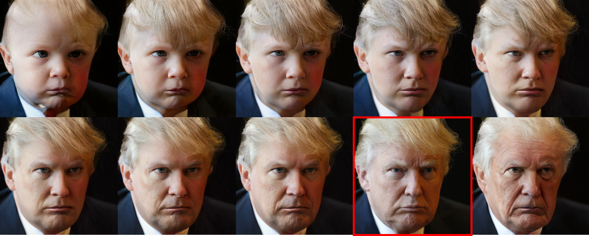

## AgeTransGAN &mdash; Official Pytorch Implementation




**Samples:** *Made by the AgeTransGAN for age regression and progression. The face in the red bbox is the input, and the rest are generated aged faces, all in 10242 pixels.*

**Abstract:** *We propose the AgeTransGAN for facial age transformation. The proposed AgeTransGAN is composed of an encoder, a decoder, a discriminator, an age classifier and a face expert. The encoder converts an input image with a target age label to an identity latent code and an age latent code. The decoder, developed upon the StyleGAN2 synthesis network, takes the identity latent code and the age latent code as input to generate a face which preserves the input identity and is at the target age. The discriminator is made of the proposed Conditional Multilayer Projection (CMP) for better age feature extraction by the incorporation of the target age label into the age feature. The age classifier enhances the desired age classification, and the face expert guarantees the preservation of the input identity on the output. The novelties of this study include the following: 1) The CMP discriminator built upon multilayer age feature fused with the label-conditional projection; 2) A new architecture developed on a latest style transfer network for achieving identity-preserving facial age progression and regression in a unified framework; 3) The high-resolution facial age transformation with a competitive performance compared to state-of-the-art approaches.*

## Test and Demo
We offer two versions of our AgeTransGAN, one for 10-age-group and the other for 4-age-group. You can enter your image as the input and our AgeTransGAN generator will generate 10 or 4 aged faces as output by the following steps (it requires Linux, Python 3.6, Cuda 10.1, Pytorch 1.40, Tensorflow 2.10):

1. Change the default input image 1.jpg in [./test/run_10group.sh](./test/run_10group.sh) or [./test/run_4group.sh](./test/run_4group.sh) for using the 10-group generator or 4-group generator. 
```
> ./test/run_10group.sh
python main.py --img_size 1024 --group 10 --batch_size 16 --snapshot ./snapshot/ffhq_10group_820k.pt --file img/1.jpg
deactivate
```
```
> ./test/run_4group.sh
python main.py --img_size 1024 --group 4 --batch_size 16 --snapshot ./snapshot/ffhq_4group_750k.pt --file img/1.jpg
deactivate
```
2. Run the test code with `./test/run_10group.sh` or `./test/run_4group.sh`.

3. The outputs are written to a new directory  `/test/result/<10>-<4>`.

4. You can also use a camera to take a face as input for a live synthesis. Please run the code with `./demo/run_10group.sh` or `./demo/run_4group.sh`.

## Use of Face++ APIs
The steps of using the Face++ APIs for estimating the age of a face image are as follows:

1. Open [./faceplusplus_evaluation-master/age.sh](./faceplusplus_evaluation-master/age.sh) and [./faceplusplus_evaluation-master/face_verification.sh](./faceplusplus_evaluation-master/face_verification.sh), and enter the key.
```
-F "api_key=[Yours]" \ -F "api_secret=[Yours]" \
```

2. Run the above code and obtain the csv files:
```
./age.sh [Folders for specific age groups] [Corresponding csv files]
./face_ verification.sh [Folders for specific age groups] [Folders for original images] [Corresponding csv files]
```

## Checkpoints Download
[FFHQ-4Groups](https://drive.google.com/file/d/1zBuW5Br5RVzoaIEZxwSfx8Ec1M9lFKqI/view)

[FFHQ-10Groups](https://drive.google.com/file/d/1f3SSNukEiqdC6EMfigexASVs5pq1ee0w/view?usp=sharing)

## Training Networks
Expected training times for the default configuration using Nvidia Titan RTX GPU:

256*256 pixels:

Morph: 1 day 12 hours

CACD: 4 days

1024*1024 pixels:

FFHQ-Aging 4Groups: 24 days

FFHQ-Aging 10Groups: 31 days
